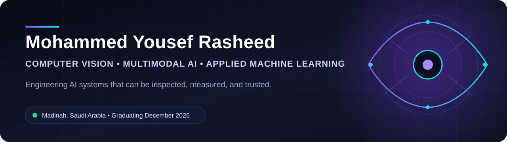

  

  
  
  

## Hello, I am Mohammed

I build applied AI systems that turn visual, audio, and text data into decisions
people can inspect and review.

I am a final year Artificial Intelligence student at the University of Prince
Mugrin, graduating in December 2026. My work spans computer vision, multimodal
integrity, spatial interaction, Arabic and English retrieval, and the engineering
needed to move a model into a dependable user workflow.

I led the computer vision and multimodal integrity workstream for **IntiqAI**,
winner of **1st Place, Best Prototype** at the Makeen Annual Forum 2026.

<table>
  <tr>
    <td align="center"><strong>1st Place</strong> Best Prototype Makeen Forum 2026</td>
    <td align="center"><strong>40,098</strong> Quran and Hadith retrieval records</td>
    <td align="center"><strong>39</strong> grocery classes in Smart Cashier</td>
    <td align="center"><strong>401,059</strong> ISIC cases studied under extreme imbalance</td>
  </tr>
</table>

## Selected systems

<table>
  <tr>
    <td width="50%" valign="top">
      <h3><a href="https://github.com/CUDA-Expert/atlas-omega">Atlas Omega</a></h3>
      Spatial computing experiments that connect hand tracking, real time
      physics, and WebGL while keeping uncertainty visible.
        
      <code>MediaPipe</code> <code>Three.js</code> <code>Rapier</code>
    </td>
    <td width="50%" valign="top">
      <h3><a href="https://github.com/CUDA-Expert/quran-hadith-retrieval">Quran and Hadith Retrieval</a></h3>
      Bilingual semantic retrieval across Quran verses and the six major Hadith
      collections, with source references and explainable matches.
        
      <code>Sentence Transformers</code> <code>FAISS</code> <code>TF IDF</code>
    </td>
  </tr>
  <tr>
    <td width="50%" valign="top">
      <h3><a href="https://github.com/CUDA-Expert/smart-cashier">Smart Cashier</a></h3>
      A vision assisted checkout workflow that turns grocery detections into a
      reviewable invoice and controlled inventory update.
        
      <code>YOLOv8</code> <code>OpenCV</code> <code>Streamlit</code>
    </td>
    <td width="50%" valign="top">
      <h3><a href="https://github.com/CUDA-Expert/skin-lesion-ml-study">Skin Lesion ML Study</a></h3>
      An academic study of malignancy classification where the positive class
      represents roughly one tenth of one percent of the dataset.
        
      <code>PyTorch</code> <code>ResNet50</code> <code>Scikit learn</code>
    </td>
  </tr>
</table>

## Engineering toolkit

**Vision and multimodal**

`Python` `PyTorch` `OpenCV` `InsightFace` `YOLOv8` `MediaPipe`
`Vision Transformers` `WavLM` `FFmpeg`

**NLP and retrieval**

`Sentence Transformers` `FAISS` `TF IDF` `Arabic normalization`
`Hybrid search` `Information retrieval evaluation`

**Systems**

`FastAPI` `PostgreSQL` `AWS S3` `Linux` `JavaScript` `Streamlit`
`CUDA enabled workflows`

## How I work

I care about reproducible evaluation, visible failure states, human review, and
clear boundaries between model output and evidence. The public repositories
below are portfolio case studies. Full team source and restricted artifacts
remain private where licensing, provenance, or continuing development requires
it.

  <strong>Computer vision • Multimodal AI • Retrieval systems • Applied machine learning</strong>

