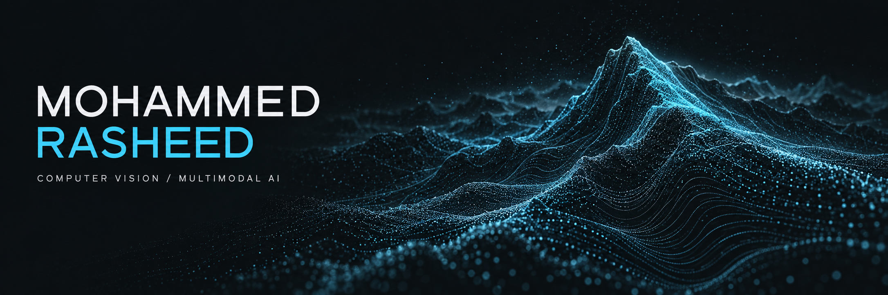
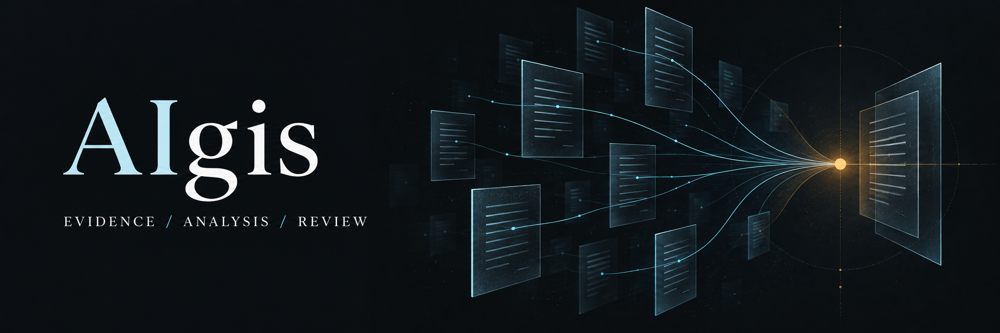
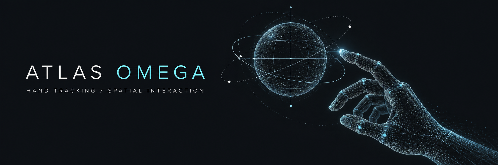
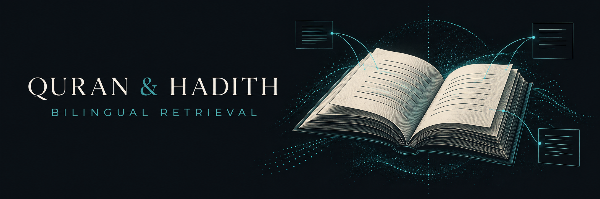
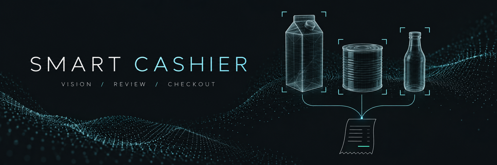
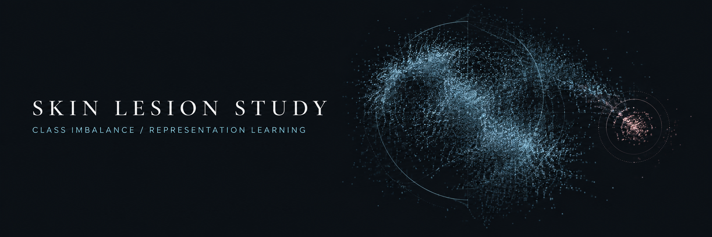

  

# Mohammed Yousef Rasheed

**Computer Vision · Multimodal AI · LLM Systems & Evaluation**

I build AI systems for visual understanding, retrieval, and evidence people can inspect. My work spans model development, evaluation, and integration into applications.

[LinkedIn](https://www.linkedin.com/in/mohammed-rasheed-ai/) · [Email](mailto:mo394ai@gmail.com) · [Selected work](#selected-work) · [Research](#research)

Madinah, Saudi Arabia · B.Sc. Artificial Intelligence, University of Prince Mugrin · Expected December 2026

## Selected work

<table>
<tr>
<td width="50%" valign="top">

<h3><a href="https://github.com/CUDA-Expert/IntiqAI">IntiqAI</a></h3>

Multimodal hiring integrity with timestamped observations and evidence for human review.

<strong>My contribution</strong> Computer vision and multimodal integrity workstream.

<strong>Best Prototype, 1st Place</strong> Makeen Annual Forum 2026, Computer Science track.

<a href="https://github.com/CUDA-Expert/IntiqAI">Explore the project ↗</a> · <a href="https://www.al-madina.com/ampArticle/993010">Award coverage</a>

Team capstone · Further development ongoing
</td>
<td width="50%" valign="top">

<h3><a href="https://github.com/CUDA-Expert/AIgis">AIgis</a></h3>

Compromise assessment across Windows Event Logs and memory evidence, with findings reviewed by an analyst.

<strong>My contribution</strong> Project Lead, with Core AI, Architecture and Integration responsibilities.

<strong>94.1% micro F1 on Event Logs</strong> Reported team result on 18 samples in a frozen controlled lab evaluation.

<a href="https://github.com/CUDA-Expert/AIgis">Explore the project ↗</a> · <a href="https://github.com/CUDA-Expert/AIgis#results">Evaluation scope</a>

Ten person team · Summer training with Tamkeen Technologies
</td>
</tr>
</table>

### ATLAS Omega

Hand tracking, real time physics, and WebGL. An individual project exploring spatial interaction, with documented experiments, interface imagery, and an open account of the engineering work still needed.

**MediaPipe · Three.js · WebGL** · [Explore the experiments and prototype](https://github.com/CUDA-Expert/atlas-omega)

### Further projects

<table>
<tr>
<td width="38%"></td>
<td><strong><a href="https://github.com/CUDA-Expert/quran-hadith-retrieval">Quran &amp; Hadith Retrieval</a></strong> Arabic and English search across 40,098 records. My work: Arabic normalization, hybrid retrieval, and the evaluation harness. Corpus size describes scale; retrieval quality evaluation is pending.</td>
</tr>
<tr>
<td width="38%"></td>
<td><strong><a href="https://github.com/CUDA-Expert/smart-cashier">Smart Cashier</a></strong> Grocery detection connected to a reviewable checkout. My work: dataset preparation, detector training, and Streamlit integration. Reported mAP@0.5: 0.9696 on the original validation split.</td>
</tr>
<tr>
<td width="38%"></td>
<td><strong><a href="https://github.com/CUDA-Expert/skin-lesion-ml-study">Skin Lesion Study</a></strong> Classification under extreme class imbalance in the ISIC 2024 setting. My work: CNN and image preprocessing. Academic team study; no published performance benchmark.</td>
</tr>
</table>

The covers are concept illustrations. Each project page identifies its public material, contribution scope, and evaluation limits. Source code remains private.

## Technical focus

| Area | Selected tools and methods |
| --- | --- |
| Vision and multimodal | PyTorch, OpenCV, InsightFace, YOLOv8, MediaPipe, WavLM |
| LLM systems and retrieval | Local model serving, Sentence Transformers, FAISS, structured outputs |
| Applications and data | FastAPI, PostgreSQL, SQLAlchemy, AWS S3 |
| Evaluation | Benchmark design, ground truth, threshold analysis, retrieval and detection metrics |

## Research

**AUT4M · Expert System Supporting Autism Screening in Children**

Lead author of a working paper on a GARS based screening support methodology, developed collaboratively and trialled under psychologist supervision. Designed for screening support, not standalone diagnosis.

<strong>Earlier work and development</strong>

**Pix-alchemist (2024).** Image enhancement for 600 degraded grayscale images of Madinah date varieties, refined through more than 270 controlled experiments.

**Project Bayan (2023).** Team robotics project involving motion sequencing, voice interaction, assembly, and iterative testing in a five day programme. The prototype was demonstrated to HRH Prince Muqrin bin Abdulaziz and HRH Prince Faisal bin Salman, with national television coverage.

| Year | Development |
| --- | --- |
| 2023 | Humanoid Robot Programming, Smart Methods |
| 2022 | Deep Learning Specialization, DeepLearning.AI |
| 2022 | AI Summer Champions Program, SDAIA |

## Connect

Open to AI engineering opportunities and research collaboration.

[LinkedIn](https://www.linkedin.com/in/mohammed-rasheed-ai/) · [mo394ai@gmail.com](mailto:mo394ai@gmail.com)

Arabic native · English professional
