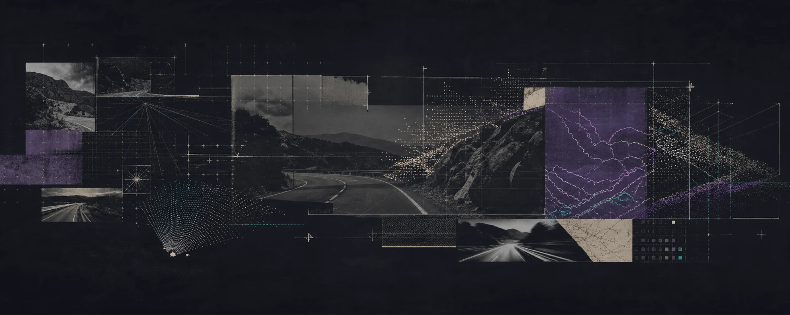

  

<h1 align="center">Mohammed Yousef Rasheed</h1>

  <strong>Computer Vision · Multimodal AI · Applied Machine Learning</strong>

  Final year Artificial Intelligence student at the University of Prince Mugrin 
  AI &amp; Cybersecurity Trainee at Tamkeen Technologies · Open to COOP opportunities

  
  

## What I build

I am an AI Engineer with practical project experience across computer vision,
NLP, machine learning, deep learning, image processing, and multimodal systems.
My core focus is computer vision and multimodal AI. I work across the wider AI
stack, from data and model development to evaluation and product integration.

## Recognition

<table>
  <tr>
    <td width="28%" align="center">
      <h3>1st Place</h3>
      <strong>Best Prototype</strong>
    </td>
    <td width="72%">
      <strong>IntiqAI · Makeen Annual Forum 2026</strong> 
      Computer Science track, across universities in the Madinah Region. 
      <a href="https://www.al-madina.com/ampArticle/993010">Award coverage</a>
    </td>
  </tr>
</table>

IntiqAI began as a senior capstone team project. It is now being developed
further by the team, with patent work and startup planning in progress.

## Tools I reach for

  
  
  
  
  
  
  
  
  
  
  
  

