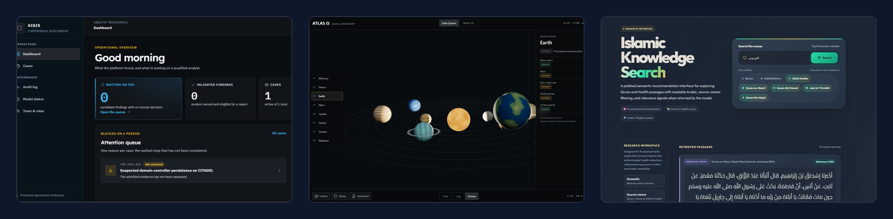

  

<h1 align="center">Mohammed Yousef Rasheed</h1>

  <strong>Computer Vision · Multimodal AI · LLM Systems and Evaluation</strong>

  BSc in Artificial Intelligence · University of Prince Mugrin · Madinah, Saudi Arabia

  
  

## What I build

I build AI systems that are **measured rather than demonstrated**. A working
demo and a system you can trust are different artifacts, and the distance
between them is evaluation: a frozen protocol, ground truth someone can argue
with, and a stated limit on what the numbers cover.

My core focus is computer vision and multimodal AI, extending into
retrieval-grounded LLM pipelines, benchmark design, and evidence-integrity data
modeling.

## Recognition

<table>
  <tr>
    <td width="28%" align="center">
      <h3>1st Place</h3>
      <strong>Best Prototype</strong>
    </td>
    <td width="72%">
      <strong>IntiqAI · Makeen Annual Forum 2026</strong> 
      Computer Science track, ranked first among senior capstone projects from
      the University of Prince Mugrin, Taibah University, and the Islamic
      University of Madinah. 
      <a href="https://www.al-madina.com/ampArticle/993010">Award coverage</a>
    </td>
  </tr>
</table>

## Selected work

Every repository below is a case study. Source stays private; the architecture,
the numbers, and the limits are public.

<table>
  <tr>
    <td width="50%" valign="top">
      <h3><a href="https://github.com/CUDA-Expert/AIgis">AIgis</a></h3>
      Evidence-led compromise assessment across Windows Event Logs and memory
      forensics, with every finding bound to a citation an analyst can open.  
      <strong>94.1%</strong> micro F1 · <strong>100%</strong> evidence-grounded ·
      <strong>0</strong> hallucinations 
      Project lead and core AI architect, ten person team, Tamkeen Technologies
    </td>
    <td width="50%" valign="top">
      <h3><a href="https://github.com/CUDA-Expert/IntiqAI">IntiqAI</a></h3>
      Hiring integrity platform with continuous identity verification, liveness
      and synthetic media screening, and reviewer-facing evidence.  
      <strong>5</strong> integrity modules · <strong>2</strong> modalities ·
      <strong>0</strong> automated rejections 
      Computer vision and multimodal integrity lead · in development
    </td>
  </tr>
  <tr>
    <td width="50%" valign="top">
      <h3><a href="https://github.com/CUDA-Expert/atlas-omega">ATLAS Omega</a></h3>
      Hand-tracked spatial interaction and a causal observatory where every
      displayed value carries its provenance, and abstention is a supported
      outcome.  
      <strong>WebGL</strong> · <strong>MediaPipe</strong> ·
      <strong>6</strong> self-audited defects published 
      Individual research project
    </td>
    <td width="50%" valign="top">
      <h3><a href="https://github.com/CUDA-Expert/quran-hadith-retrieval">Quran and Hadith Retrieval</a></h3>
      Bilingual semantic retrieval over scripture and the six canonical Hadith
      collections, with an explanation attached to every match.  
      <strong>40,098</strong> records · <strong>6,236</strong> verses ·
      <strong>33,862</strong> Hadith 
      Arabic normalization and hybrid retrieval layer
    </td>
  </tr>
  <tr>
    <td width="50%" valign="top">
      <h3><a href="https://github.com/CUDA-Expert/smart-cashier">Smart Cashier</a></h3>
      Vision-assisted checkout over a Saudi grocery catalogue, where a detection
      is a suggestion until a person confirms the basket.  
      <strong>0.9696</strong> mAP@0.5 · <strong>39</strong> classes ·
      <strong>9</strong> categories 
      University team project
    </td>
    <td width="50%" valign="top">
      <h3><a href="https://github.com/CUDA-Expert/skin-lesion-ml-study">Skin Lesion Study</a></h3>
      Malignancy classification under extreme class imbalance, where a constant
      predictor scores 99.90 percent accuracy and catches nothing.  
      <strong>401,059</strong> cases · <strong>393</strong> malignant ·
      <strong>0.098%</strong> prevalence 
      CNN and image-preprocessing track
    </td>
  </tr>
</table>

## How I work

A few positions these projects have in common, arrived at by building them:

- **Abstention beats a confident guess.** AIgis reports `insufficient_evidence`,
  ATLAS Omega returns `ABSTAIN` when its own gates fail, and Smart Cashier shows
  unmatched items rather than pricing them. A system that cannot say *I do not
  know* will say something worse.
- **A finding needs a citation.** Every AIgis conclusion resolves to a stored
  record. Every retrieval result carries its source and why it matched. An
  answer nobody can check costs a reviewer more than no answer.
- **Report the denominator.** Micro and macro separately, per evidence domain,
  never pooled to look better.
- **Publish the limits.** Every repository here states what its numbers do not
  cover, and two of them state why no numbers are published at all.

## Stack

**Core** · Python · PyTorch · OpenCV · NumPy · Pandas · Scikit-learn · FastAPI · PostgreSQL · Git · Linux

**Vision and multimodal** · InsightFace (SCRFD, ArcFace) · Ultralytics YOLOv8 · Vision Transformers · MiniFASNet · MediaPipe · WavLM · FFmpeg · temporal video analysis

**LLM and retrieval** · Retrieval-augmented generation · local serving with Ollama · embedding retrieval and semantic reranking · FAISS · Sentence Transformers · Hugging Face Transformers · structured JSON-schema outputs · multi-stage orchestration

**Data and backend** · PostgreSQL schema design · row-level security · append-only and audit modeling · SQLAlchemy · Alembic · AWS S3 · Supabase · pytest

**Evaluation** · Benchmark design · ground-truth construction · precision, recall, F1 (micro and macro) · mAP · MRR · nDCG · threshold calibration · class-imbalance handling · transfer learning

**Working knowledge** · C/C++ · JavaScript · Three.js · WebGL · TensorFlow/Keras · Volatility 3 · MITRE ATT&CK · LiveKit WebRTC · CUDA-enabled GPU workflows

## Research

**AUT4M · Expert System Supporting Autism Screening in Children**. Working paper,
lead author. A GARS-based screening support methodology with a
knowledge-management and inference pipeline, trialled under psychologist
supervision, positioned as clinical decision support rather than a standalone
diagnostic tool.

## Also

**Pix-alchemist** (2024). Enhancement of 600 degraded grayscale images of
Madinah date varieties through a multi-stage OpenCV pipeline, refined across
more than 270 controlled experiments.

**Project Bayan** (2023). Interactive Arabic coffee-serving robot built in a
five-day program, demonstrated to HRH Prince Muqrin bin Abdulaziz and HRH Prince
Faisal bin Salman, and featured in national television coverage including Al
Arabiya.

## Honors and development

| | |
| --- | --- |
| **2026** | Best Prototype Award, 1st Place, Makeen Annual Forum, Computer Science track |
| **2023** | Humanoid Robot Programming, Smart Methods (MECAI) |
| **2022** | Deep Learning Specialization, DeepLearning.AI |
| **2022** | AI Summer Champions Program, Saudi Data and AI Authority (SDAIA) |

---

  Arabic native · English professional · Open to AI engineering roles and research collaboration

